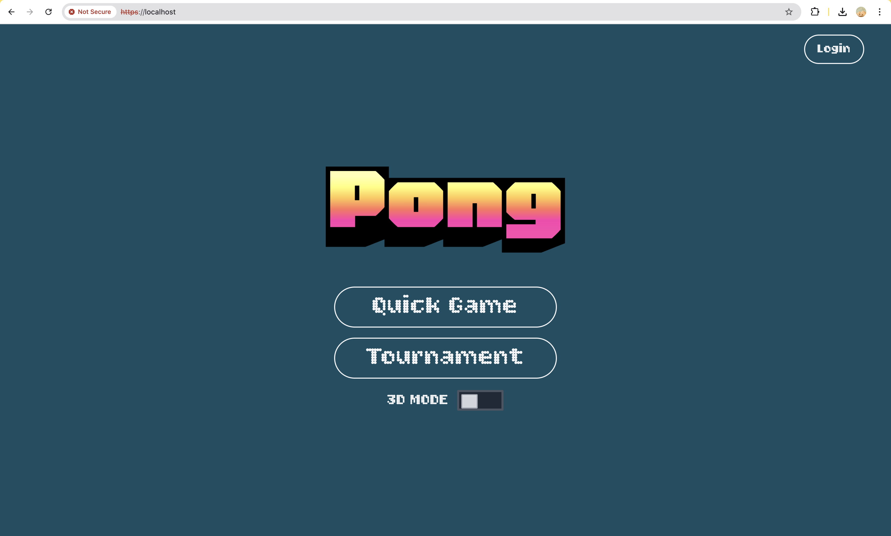
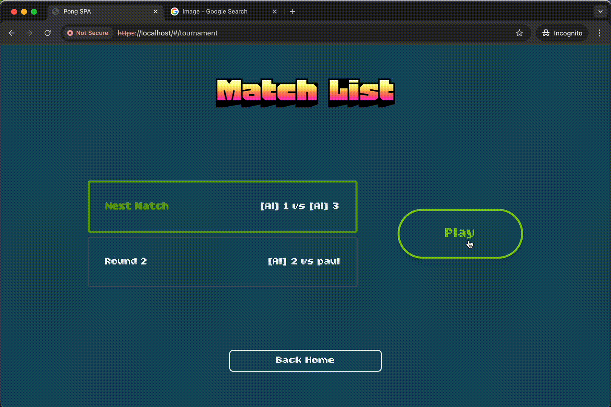
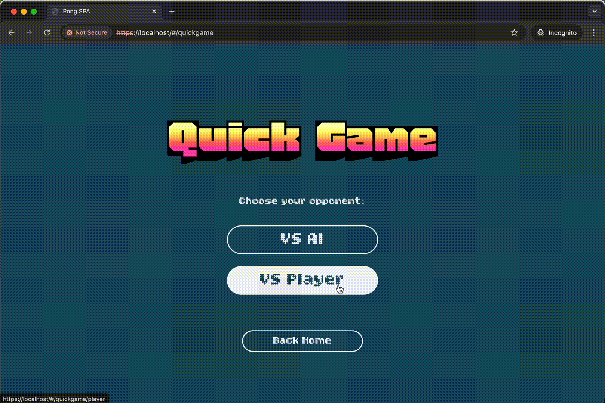
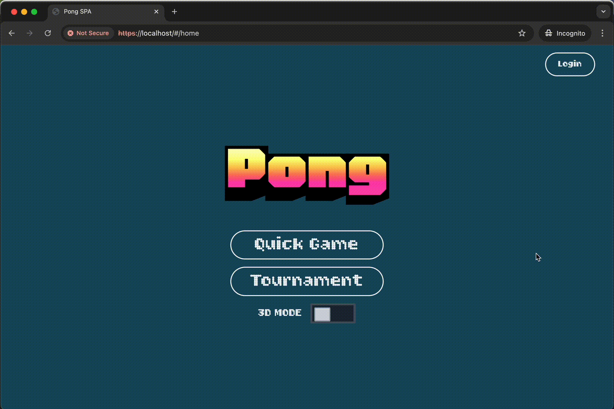

# transcendence - 42 project

<p align="center">
  
</p>

A full-stack Pong game with extensive [features](#features) built as the final project of 42's Common Core .
Developed with Fastify (Node.js), TypeScript, Tailwind, and an SQLite-backed microservice architecture, the project combines gameplay, user management, modern web design, blockchain integration, and 3D graphics.

It includes customizable gameplay, an AI opponent, 3D visual enhancements, tournament score storage on the Avalanche blockchain, and structured log management infrastructure. Designed with scalability and modularity in mind!

## Installation

Make sure you have `docker` and `make` installed on your machine. Then, clone this repository and run:

```bash
make
```

This will display a list of available commands. For a first run, simply run:

```bash
make up
```
This will create a default `.env` file, build the Docker images and start the containers.

Once compilation is done, visit https://localhost

## Features

**Customizable Gameplay**

<p align="center">
  
</p>

**AI Opponent**

<p align="center">
  
</p>

**3D Graphics**

<p align="center">
  
</p>

**Tournament scores stored in Avalanche blockchain**

<p align="center">
  
</p>

**Log management**

<p align="center">
  
</p>

## About

If you don't have a clue how anything works, this very simple pong game gives a good idea of the basic stuff:

https://www.geeksforgeeks.org/javascript/pong-game-in-javascript/

Code is written in TypeScript. Browser only understands JavaScript, so the TypeScript code is compiled to JavaScript thanks to Docker.

HTML page styled with Tailwind CSS allows to introduce the different pages & elements of the website. No need to open/edit a separate stylesheet, styles are consistent across components and easy to prototype and keep the UI responsive.

The drawing and physics of the pong game on a canvas is also done with TypeScript (pong.ts)

Using Docker, we can build a Docker Image with nginx and all the frontend files copied inside.

## Useful resources:

- https://developer.mozilla.org/en-US/docs/Web/API/Canvas_API (the Canvas API is used to draw the pong game)

- https://developer.mozilla.org/en-US/docs/Web/API/HTML_DOM_API

- https://developer.mozilla.org/en-US/docs/Web/API/Document_Object_Model


