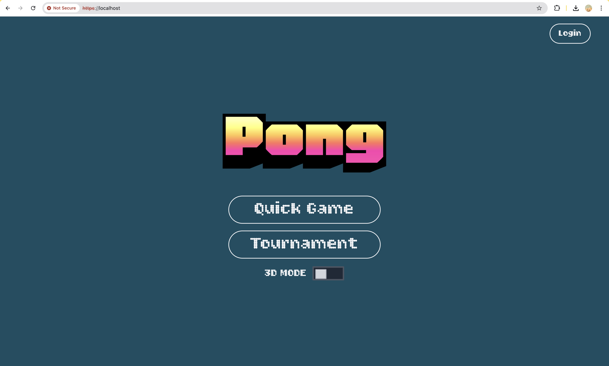
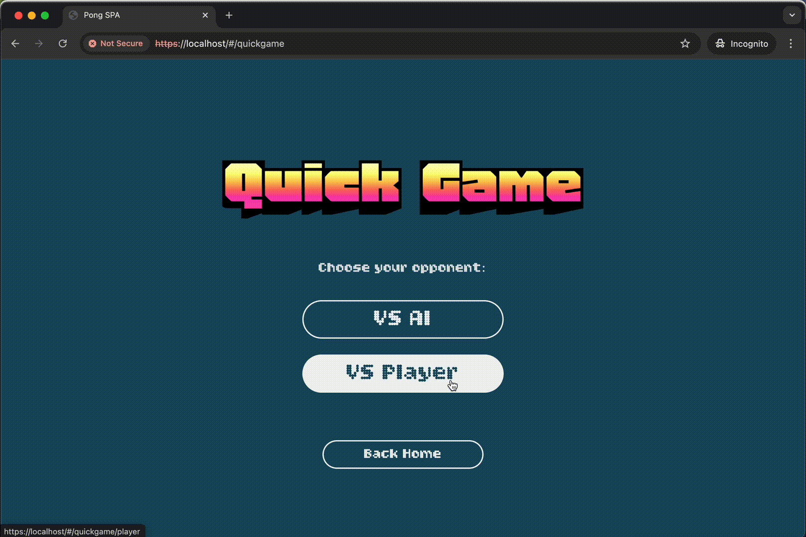
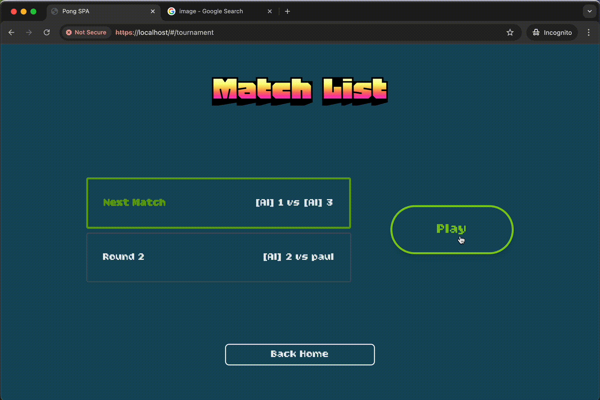
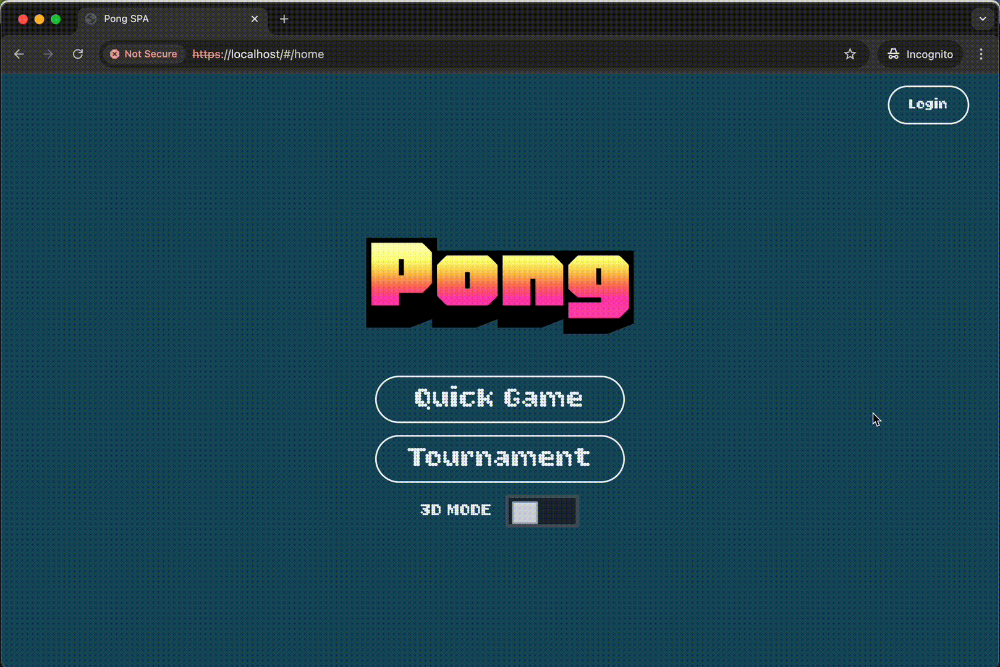

# Transcendence: Full-Stack Pong Platform

<p align="center">
  
</p>

A production-ready, full-stack multiplayer gaming platform featuring Pong with real-time gameplay, blockchain integration, and enterprise-grade infrastructure. Built with modern web technologies and deployed as a containerized microservices architecture.

**Key Technologies:** Node.js • TypeScript • Fastify • React • Babylon.js • SQLite • Avalanche Blockchain • Docker • Elasticsearch • Tailwind CSS

---

## Project Overview

Transcendence is a comprehensive demonstration of full-stack software engineering, combining competitive Pong gameplay with sophisticated user management, tournament systems, and blockchain-backed score verification. The application showcases best practices in microservices architecture, real-time game state management, and secure authentication.

### Completed Modules

#### Major Modules

- **Use Fastify with Node.js to build the backend**

- **Use Avalanche and Solidity to store the score of a tournament in the Blockchain**

- **Standard user management, authentication, users across tournaments**

- **Introduce an AI opponent**

- **Infrastructure setup for log management**

- **Designing the backend as microservices**

- **Use advanced 3D techniques**

#### Minor Modules

- **Use Tailwind CSS in addition of the TypeScript to build the frontend**

- **Use SQLite database for the backend**.

- **Game customization options**

- **Expanding browser compatibility**


See [full checklist](docs/CHECKLIST.md).

**Total Score: 9/7 points** (exceeded project requirements)

---

## Installation & Quick Start

### Prerequisites
- Docker & Docker Compose
- Make
- OpenSSL (for certificate generation)

### Setup
```bash
# Clone repository
git clone <repo-url>
cd transcendence

# Display available commands
make

# First-time setup and launch
make up
```

This will:
1. Generate `.env` file with random secrets
2. Create SSL certificates
3. Build all Docker images
4. Start all services

### Accessing the Application
```
https://localhost
```

### Available Commands
| Command | Purpose |
|---------|---------|
| `make up` | Build and start all services |
| `make down` | Stop all services |
| `make clean` | Stop services and remove database |
| `make test` | Run unit tests for all services |
| `make logs` | Start ELK Stack (logging dashboard) |
| `make load` | Load sample data into database |

---

## Testing

The project includes comprehensive test suites:
```bash
make test
```

Tests cover:
- User registration and authentication
- Tournament score tracking
- Game state management
- API endpoint validation
- Blockchain contract interactions

---

## Service Breakdown

| Service | Purpose | Technology |
|---------|---------|-----------|
| **API Gateway** | Routing, authentication, rate limiting | Fastify, JWT |
| **Users Service** | Authentication, profile management | Fastify, bcrypt, better-sqlite3 |
| **Tournaments Service** | Tournament creation, score tracking | Fastify, SQLite |
| **Blockchain Service** | Score immutability on Avalanche | Hardhat, Solidity, Web3.js |
| **Frontend** | Game UI and 3D rendering | TypeScript, Babylon.js, Tailwind CSS |
| **Proxy** | SSL termination, load balancing | Nginx |
| **ELK Stack** | Centralized logging & monitoring | Elasticsearch, Logstash, Kibana |

---

## Core Features

### Multiplayer Pong Engine
- Real-time 2D/3D game rendering with state synchronization
- Configurable game parameters (paddle speed, ball velocity, difficulty)
- Hidden canvas game loop feeding 3D visualization
- Collision detection and physics simulation

### AI Opponent System



- Intelligent paddle control algorithm
- Adaptive difficulty levels
- Realistic player-like behavior patterns

### User Management
- Secure JWT-based authentication
- Password hashing with bcrypt
- User profiles with statistics
- Friend request/management system
- User search and discovery

### Game Customization



- Adjustable paddle speed and ball velocity
- Multiple map/texture themes
- Power-up toggles

### Tournament System
- Tournament creation and bracket management
- Score calculation and leaderboards
- Historical match tracking
- Integration with blockchain for permanent record

### 3D Graphics Engine



- Babylon.js-powered 3D rendering
- Textured game environments
- Dynamic camera controls
- Shader-based visual effects
- Real-time state synchronization with 2D game loop

### Blockchain Integration (Avalanche)


- Smart contract-based tournament registry
- Immutable score storage on-chain
- Solidity contract deployment and interaction
- Fuji testnet integration

### Log Management


- Centralized log aggregation with Elasticsearch
- Structured logging across all services
- Kibana visualization dashboard
- Real-time log streaming and analysis

---

## Technical Highlights

### Scalable Microservices Architecture
- **Service Isolation**: Each service has independent database and deployment
- **API Gateway Pattern**: Centralized routing with authentication middleware
- **Container Orchestration**: Docker Compose for local/staging environments
- **Horizontal Scalability**: Services can be independently scaled

### Security & Authentication
- **JWT Tokens**: Stateless, scalable authentication
- **Password Hashing**: bcrypt with salt rounds
- **Rate Limiting**: Built-in Fastify rate limiting middleware
- **HTTPS/SSL**: Self-signed certificates for secure communication
- **API Key Authorization**: Internal service authentication

### Database
- **SQLite**: Lightweight, serverless persistence layer
- **Connection Pooling**: better-sqlite3 for efficient concurrent access
- **Transaction Support**: ACID compliance for data integrity
- **Schema Flexibility**: Easy schema migrations for service evolution

### Game State Management
TypeScript-based immutable game state:
```typescript
interface GameState {
  paddle1Y: number;
  paddle2Y: number;
  ballX: number;
  ballY: number;
  ballSpeedX: number;
  ballSpeedY: number;
  score1: number;
  score2: number;
  gameRunning: boolean;
  ballFlash: number;
  powerUpActive?: boolean;
}
```

### Real-Time Rendering
- **2D Canvas**: Hidden game loop handling physics
- **3D Visualization**: Babylon.js subscribes to frame-by-frame state
- **Texture Mapping**: Dynamic environment customization
- **Performance**: Decoupled rendering from game logic

---

## Documentation & References

### Project Documentation
- [API Reference](docs/API.md) - Complete endpoint documentation
- [Blockchain Setup](docs/CHAIN.md) - Avalanche integration guide  
- [Checklist](docs/CHECKLIST.md) - Module completion status

### Backend Tools & Libraries

**Framework & HTTP**
- [Fastify](https://www.fastify.io/) - High-performance Node.js framework
- [fastify/jwt](https://github.com/fastify/jwt) - JWT authentication middleware
- [fastify/auth](https://github.com/fastify/auth) - Authorization plugin

**Database**
- [better-sqlite3](https://github.com/WiseLibs/better-sqlite3) - SQLite database driver with connection pooling
- [SQLite](https://www.sqlite.org/) - Lightweight relational database

**Security**
- [bcrypt](https://www.npmjs.com/package/bcrypt) - Password hashing library
- [UUID](https://www.npmjs.com/package/uuid) - Unique identifier generation

**Blockchain**
- [Hardhat](https://hardhat.org/) - Ethereum development framework
- [Solidity](https://soliditylang.org/) - Smart contract language
- [Web3.js](https://web3js.readthedocs.io/) - Blockchain interaction library
- [Avalanche](https://www.avax.network/) - Blockchain platform

**Logging & Monitoring**
- [Pino](https://getpino.io/) - Low-overhead JSON logging
- [Elasticsearch](https://www.elastic.co/elasticsearch/) - Search and analytics engine
- [Logstash](https://www.elastic.co/logstash/) - Log processing pipeline
- [Kibana](https://www.elastic.co/kibana/) - Data visualization platform

### Frontend Tools & Libraries

**Language & Build Tools**
- [TypeScript](https://www.typescriptlang.org/) - JavaScript with static typing
- [Vite](https://vitejs.dev/) - Lightning-fast build tool and dev server
- [Tailwind CSS](https://tailwindcss.com/) - Utility-first CSS framework

**3D Graphics & Game Engine**
- [Babylon.js](https://www.babylonjs.com/) - Full-featured 3D engine
- [Babylon.js Materials](https://www.babylonjs-playground.com/) - Advanced shader effects
- [Babylon.js Loaders](https://doc.babylonjs.com/latest/features/featuresDeepDive/Importers/Loaders) - Asset loading system

